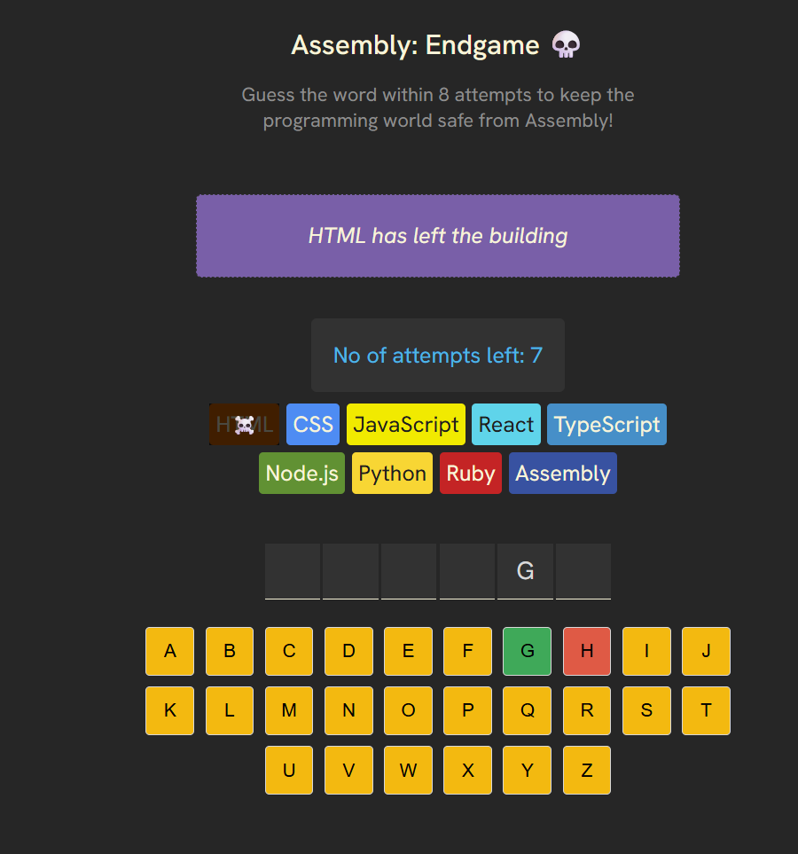

# Assembly Endgame

A fun word-guessing game inspired by [Scrimba](https://scrimba.com/frontend-path-c0j/~06jd), where you must save the programming world from Assembly by guessing the secret word before you run out of attempts!

## Features

- Guess a random word from a large list
- Each wrong guess "eliminates" a programming language
- Farewell messages for each lost language
- Visual feedback for correct and incorrect guesses
- Confetti celebration when you win
- Accessible and keyboard-friendly UI
- Built with React and Vite

## Screenshot



## How to Play

1. Guess the hidden word by clicking the on-screen keyboard.
2. Each incorrect guess eliminates a programming language.
3. You have 8 attempts before Assembly takes over!
4. Win by guessing all the letters before running out of attempts.

## Getting Started

### Prerequisites

- [Node.js](https://nodejs.org/) (v16 or higher recommended)
- [npm](https://www.npmjs.com/) or [yarn](https://yarnpkg.com/)

### Installation

1. Clone this repository:
    ```sh
    git clone https://github.com/your-username/assembly-endgame.git
    cd assembly-endgame
    ```
2. Install dependencies:
    ```sh
    npm install
    ```
    or
    ```sh
    yarn
    ```

### Running the App

Start the development server:

```sh
npm run dev